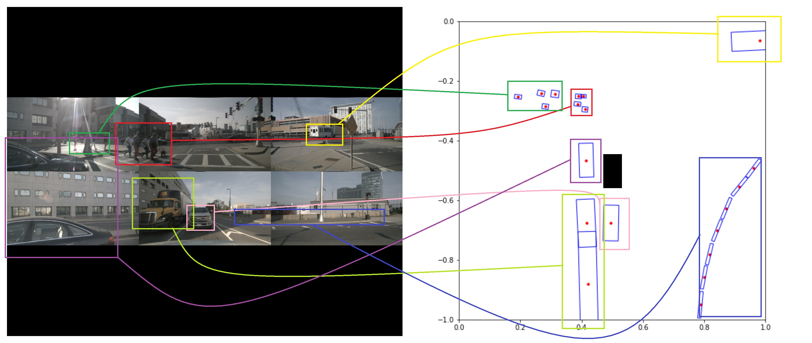

# Perception System - Autonomous Vehicles
An AI based Perception System that is capable of mapping objects from images into 3d space along with a UI showing the birds eye view of the scenario is implemented.
The AI model is an end to end model that takes input from the 6 cameras positioned on the ego vehicle for 360 degree coverage and predicts the position, size, rotation and category of objects surrounding the ego vehicle.

Dataset used : https://www.nuscenes.org

## Camera View and the expected AI output:
The left image represents the input from the 6 cameras in which the top row represents the font left , front and front right camera views from left to right and the bottem row represents the back right, back and back left camera views from left to right.
The right image represents the birds eye view of the scene on the left and is exactly how the AI model predicts the objects into 3d space 

## Current AI Sample Outputs:

more ai sample outputs from the test dataset can be found in the AI/assets folder

## BlindSpot Monitoring UI Output

## AI Model Evaluation
Metrics: mAP
<table>
  <thead>
    <tr>
      <th>Index</th>
      <th>Class name</th>
      <th>AP</th>
    </tr>
   </thead>
   <tbody>
     <tr>
       <td>0</td>
       <td>human</td>
       <td>0.00022</td>
     </tr>
     <tr>
       <td>1</td>
       <td>animal</td>
       <td>0.00000</td>
     </tr>
     <tr>
       <td>2</td>
       <td>car</td>
       <td>0.20675</td>
     </tr>
     <tr>
       <td>3</td>
       <td>motorcycle</td>
       <td>0.00000</td>
     </tr>
     <tr>
       <td>4</td>
       <td>bicycle</td>
       <td>0.00036</td>
     </tr>
     <tr>
       <td>5</td>
       <td>bus</td>
       <td>0.14353</td>
     </tr>
     <tr>
       <td>6</td>
       <td>truck</td>
       <td>0.02245</td>
     </tr>
     <tr>
       <td>7</td>
       <td>construction_vehicle</td>
       <td>0.38235</td>
     </tr>
     <tr>
       <td>8</td>
       <td>trailer</td>
       <td>0.00000</td>
     </tr>
  </tbody>
</table>
mAP : 0.08396270855610524

## Model Architecture
The AI model uses a Modified Yolo v3 in which the six images from the 6 cameras is feed through 6 different feature extraction networks(Darknet) and the output from these feature extraction networks are stacked back to back and feed to a object detector which instead of just predicting the x,y, l,w ,conf and category like the usual yolo network , it predicts x,y,z h,w,l, r1,r2 conf, category where z is the z coordinate of the centroid, h for the height of the object and r1,r2 for the orientation of the object where r1 is the sine and r2 is the cosine of the original orientation.

The code for the AI model is present in the AI/Birdnet_Yolo.ipynb python notebook and the configuration file in the AI/config/birdnet-yolo.cfg

